<meta content="text/html; charset=UTF-8" http-equiv="content-type">

統合データベース講習会：AJACS徳島

化合物データベース（Pubchem,ChEMBL）

&nbsp;〜化合物情報とバイオアッセイ〜

* 公益財団法人野口研究所 山田一作（やまだいっさく） [issaku@noguchi.or.jp](mailto:issaku@noguchi.or.jp)

* 日時：2019年6月6日（木）

---

1. 目次

2. 化合物データベース

3. 参考サイト

4. PubChem

PubChemの説明

PubChem CompoundとSubstanceの違い

PubChem BioAssayとSubstance

PubChemへのデータ登録について

インターフェイスが今年３月に更新。

ウェブブラウザを用いた検索

キーワード検索から：遺伝子名：ACADM

URLへキーワード（遺伝子名、生物種など）を用いた検索

PubChem Classification Browserを使ったデータ取得

5. ChEMBL

ChEMBLの説明

ウェブブラウザを利用して

ChEMBLのサイト（https://www.ebi.ac.uk/chembl/）を開く

概要

含まれるデータの俯瞰

階層

年代毎の分子の種類の分布

Taxonomyによる分類

開発フェーズとUSAN登録

病気のフェーズ

化合物

機能の説明

表示切り替え

絞り込み

データダウンロード

アッセイ

targets

キーワード検索

化合物・医薬品

遺伝子名

付録：ドキュメント作成手順

---

2. 化合物データベース
=====================================

* AJACS筑波４での化合物データベースについての説明へ

* [Integbioデータベースカタログ](https://www.google.com/url?q=https://integbio.jp/dbcatalog/?lang%3Dja&sa=D&ust=1559232913839000)

* [https://github.com/AJACS-training/AJACS70/tree/master/03_yamada](https://www.google.com/url?q=https://github.com/AJACS-training/AJACS70/tree/master/03_yamada%23%25E5%258C%2596%25E5%2590%2588%25E7%2589%25A9%25E3%2583%2587%25E3%2583%25BC%25E3%2582%25BF%25E3%2583%2599%25E3%2583%25BC%25E3%2582%25B9&sa=D&ust=1559232913840000)

---

3. 参考サイト
=================================

* 化合物の表記法やPubChemの使い方

* ブラウザを用いた方法について
* REST, SOAP, FTPによるデータ取得などについて

* [https://github.com/yamadaissaku/ChemDocsJP](https://www.google.com/url?q=https://github.com/yamadaissaku/ChemDocsJP&sa=D&ust=1559232913841000)
* [https://github.com/yamadaissaku/ChemInfo](https://www.google.com/url?q=https://github.com/yamadaissaku/ChemInfo&sa=D&ust=1559232913841000)

* 統合TV

* PubChemを利用して化学物質やアッセイの結果を調べる 2017

* [https://togotv.dbcls.jp/20171208.html](https://www.google.com/url?q=https://togotv.dbcls.jp/20171208.html&sa=D&ust=1559232913842000)

---

4. PubChem
===================================

PubChemの説明
-----------------------------------

* [Web検索](https://www.google.com/url?q=https://www.google.com/search?q%3Dpubchem%26oq%3Dpubchem%26aqs%3Dchrome..69i57j69i60l4j0.4321j0j4%26sourceid%3Dchrome%26ie%3DUTF-8&sa=D&ust=1559232913843000)
* PubChem公式

* [pubchemdocs](https://www.google.com/url?q=https://pubchemdocs.ncbi.nlm.nih.gov/&sa=D&ust=1559232913843000)

### PubChem CompoundとSubstanceの違い

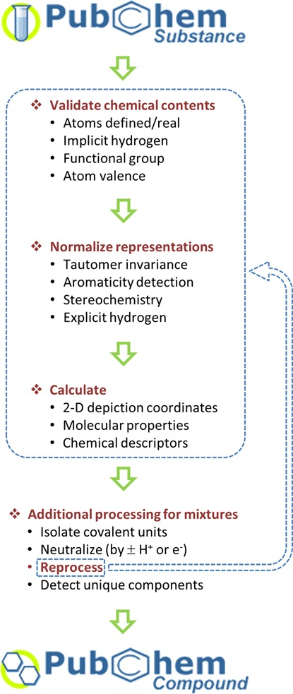

### PubChem BioAssayとSubstance

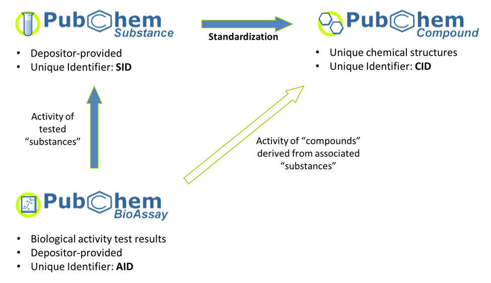

### PubChemへのデータ登録について

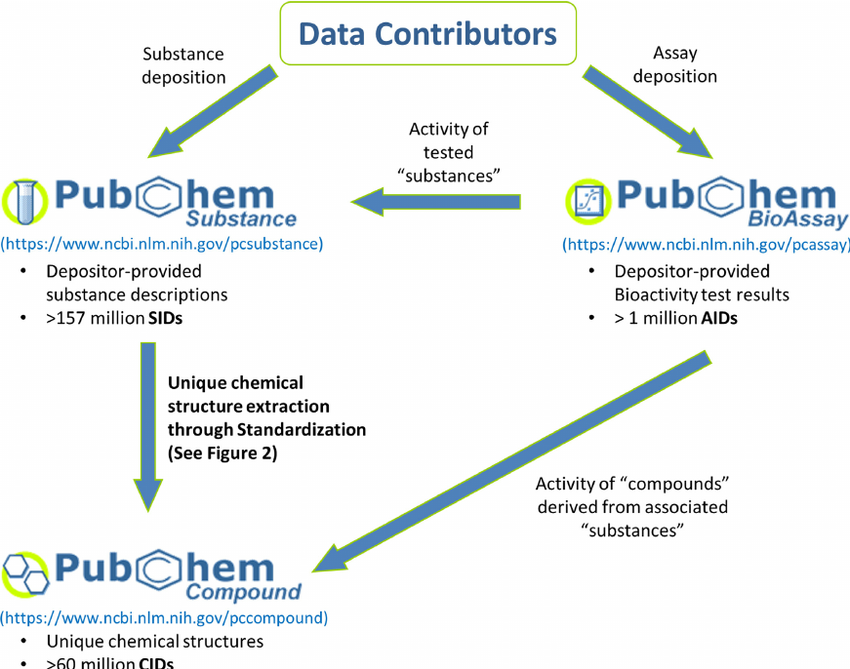

---

インターフェイスが今年３月に更新。
------------------------------------------

* [https://pubchemdocs.ncbi.nlm.nih.gov/about](https://www.google.com/url?q=https://pubchemdocs.ncbi.nlm.nih.gov/about&sa=D&ust=1559232913845000)

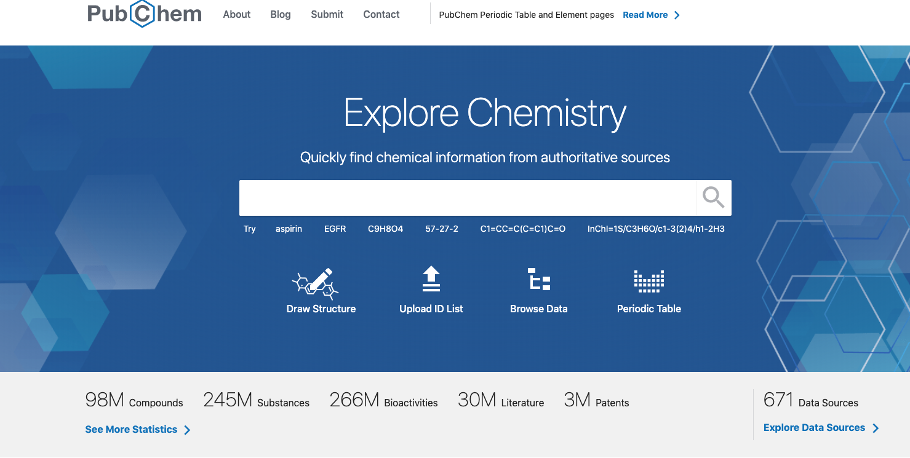

---

ウェブブラウザを用いた検索
--------------------------------------

### キーワード検索から：遺伝子名：ACADM&nbsp;

1.  [中鎖アシル CoA デヒドロゲナーゼ (MCAD) 欠損症の病因遺伝子 ：ACADM ](https://www.google.com/url?q=https://www.genome.jp/dbget-bin/www_bget?ds_ja:H00488&sa=D&ust=1559232913846000)について調べてみましょう。
2.  PubChemのサイト（[https://pubchem.ncbi.nlm.nih.gov/](https://www.google.com/url?q=https://pubchem.ncbi.nlm.nih.gov/&sa=D&ust=1559232913847000)）を開きます。

* または、Googleなどの検索エンジンで”PubChem”と検索し、下記のリンクをクリック

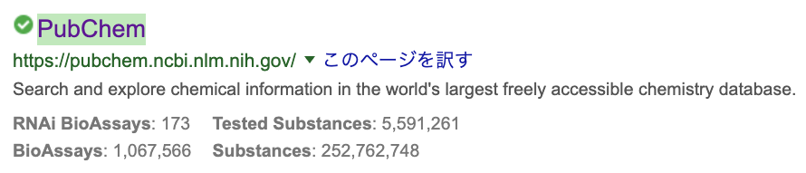

1.  下図のようにキーワード入力欄に”ACADM&nbsp;”を入力すると、Compound, Gene, Taxonomyに分類された候補キーワードが示されます。

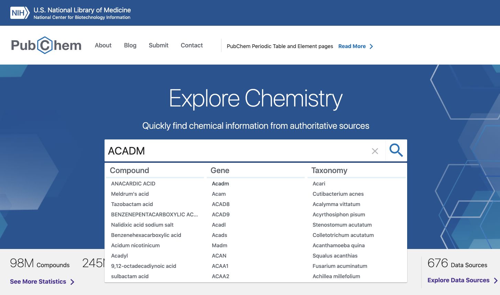

1.  今回は、"Gene"の"Acadm"をクリックすると、下図のサイトに移動します。
2.  ここでも、分類としてSubstances, Genes, BioAssays, Literature, Patentsが表示され、その下の（）内に含まれるデータの数が表示されます。

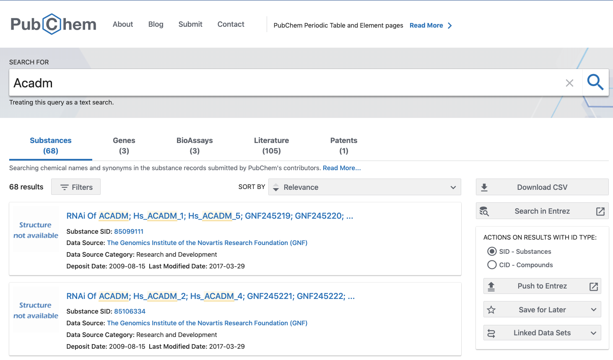

1.  ここで、"Gene"をクリックすると、taxonomy IDの異なる３個の遺伝子が含まれることがわかります。

* [9906: Homo sapiens (human) ](https://www.google.com/url?q=https://www.ncbi.nlm.nih.gov/Taxonomy/Browser/wwwtax.cgi?id%3D9606&sa=D&ust=1559232913848000)
* [10090: Mus musculus (house mouse) ](https://www.google.com/url?q=https://www.ncbi.nlm.nih.gov/Taxonomy/Browser/wwwtax.cgi?id%3D10090&sa=D&ust=1559232913849000)
* [10116: Rattus norvegicus (Norway rat) ](https://www.google.com/url?q=https://www.ncbi.nlm.nih.gov/Taxonomy/Browser/wwwtax.cgi?id%3D10116&sa=D&ust=1559232913849000)

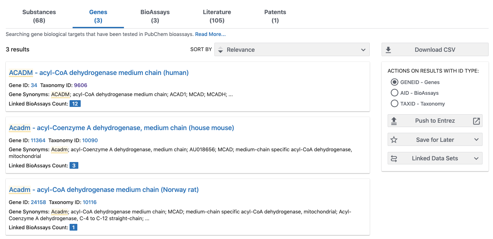

1.  ここで、各遺伝子毎にLinked BioAssays Countが表示されています。

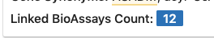

1.  Linked BioAssays Countのあとの数値、この場合は"12"をクリックすると、BioAssaysのサイトへ移動します。

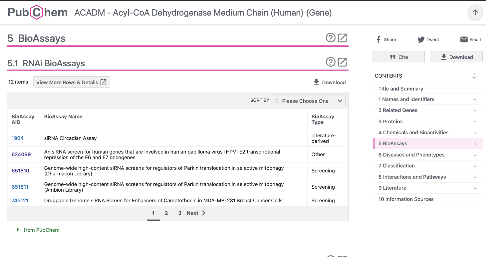

1.  Linked BioAssays Countのあとの数値、この場合は"12"をクリックすると、BioAssaysのサイトへ移動します。

* BioAssay AID,&nbsp;&nbsp;&nbsp;&nbsp;&nbsp;&nbsp;&nbsp;&nbsp;BioAssay Name, BioAssay Type の表示された表が表示されます。

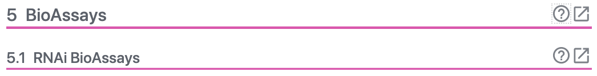

をクリックすると、説明が表示されます。この機能はPubChemの色々なサイトにありますので、”これ何？”と思ったら、クリックしてみてください。

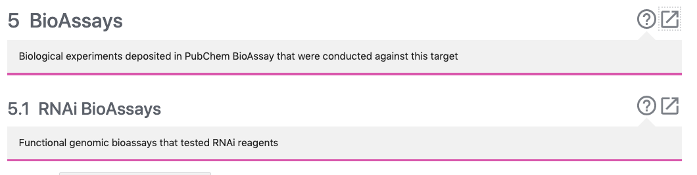

1.  右上のDownloadをクリックとCSV形式で取得することができます。ダウンロードしたCSV形式のファイルを開くと以下のようになります。

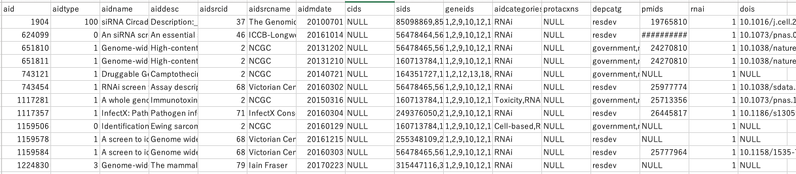

1.  テーブルの”BioAssay AID”をクリックすると、以下のようなアッセイの詳細を見ることができます。

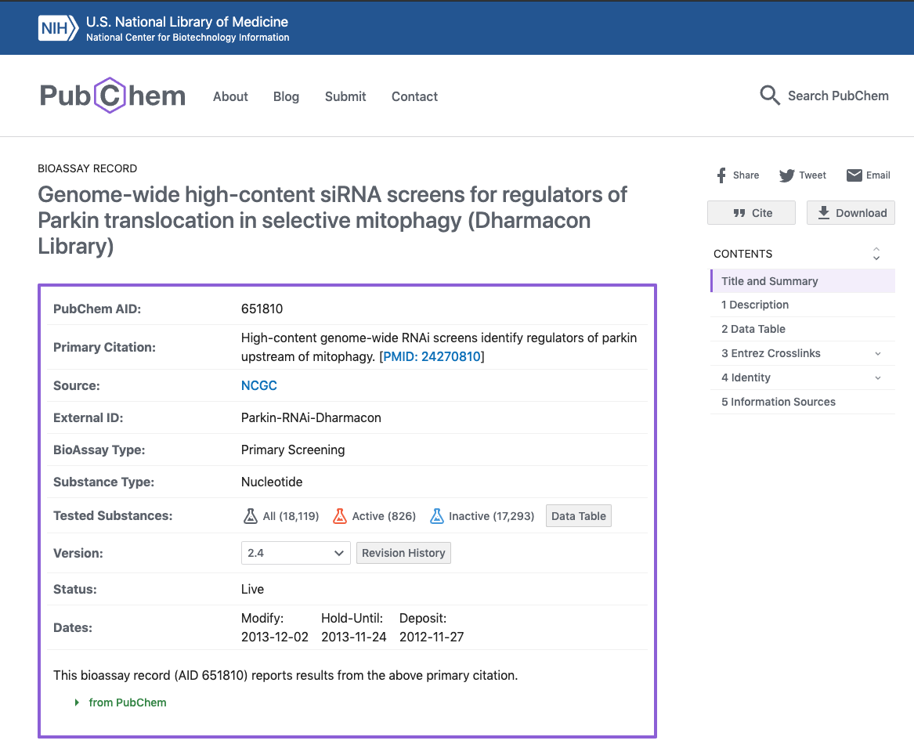

1.  詳細ページには上図のようなことが記載されています。

* ”Tested Substances:”を見ていただくと、”Active”と”Inactive”の件数がわかります。

* ”Data table”をクリックすると下記のTableが表示されます。これは、ページをスクロールすることや、ページ右端の”CONTENTS”の”2 Data Table”をクリックすることでも同様に移動できます。

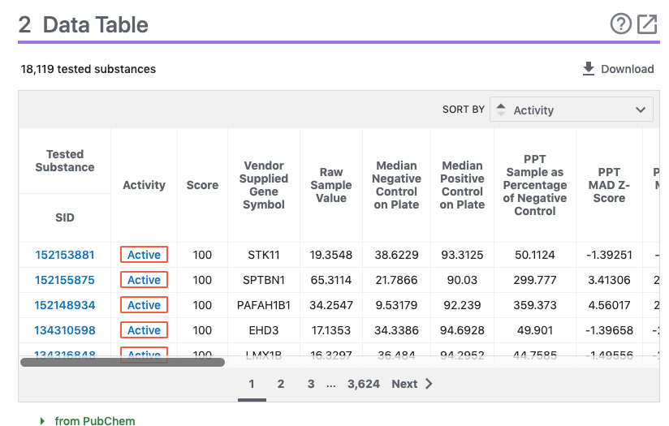

1.  右上の”？”をクリックすると ここでも説明が表示されます。

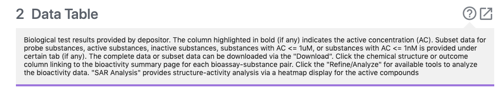

1.  Data Tableには様々な情報が登録されています。右上の”SORT BY”のプルダウンにより、Activity, Score, SID, CID

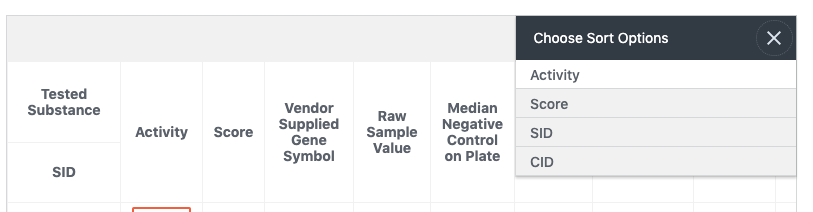

1.  右上のDownloadをクリックとCSV形式で取得することができます。また、Data Tableのダウンロードでは、下図のようにALL, ACTIVE, INACTIVEをそれぞれ取得できます。

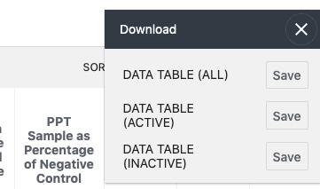

1.  取得したCSV形式のファイルを開くと以下のようになります。

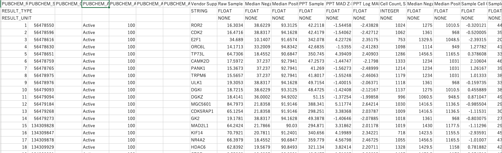

1.  Data Tableからのリンクは、SID, Activity, Entrez GeneIDから、それぞれのページに移動することができます。
2.  Data Tableの各列のSIDのSID（例えば：152153881）をクリックすると下図のようなページが表示されます。

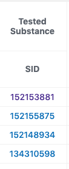

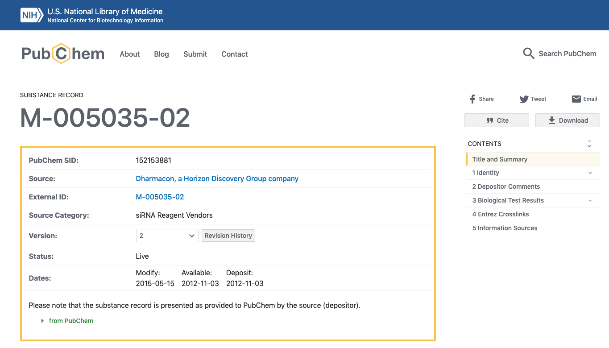

1.  このページでは、Depositor CommentsやSIDに関するBiological Test Resultsを得ることができます。

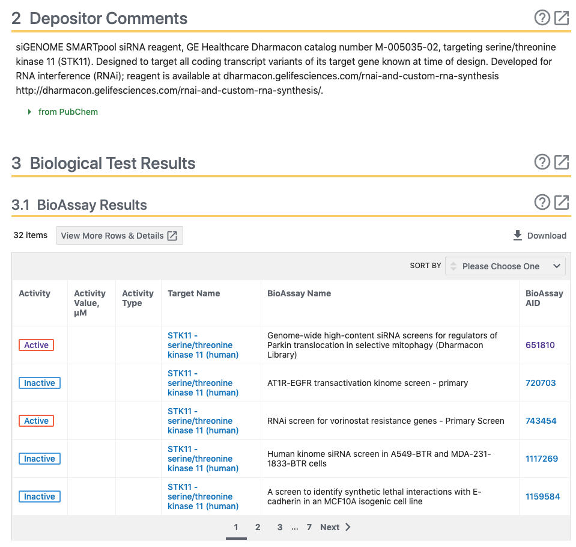

1.  Data Tableの各列のActivityのActive or Inactiveをクリックすると下図のようなページが表示されます。

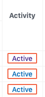

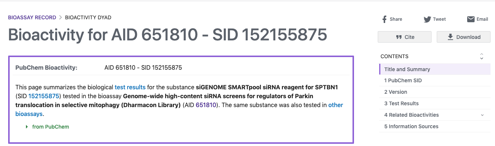

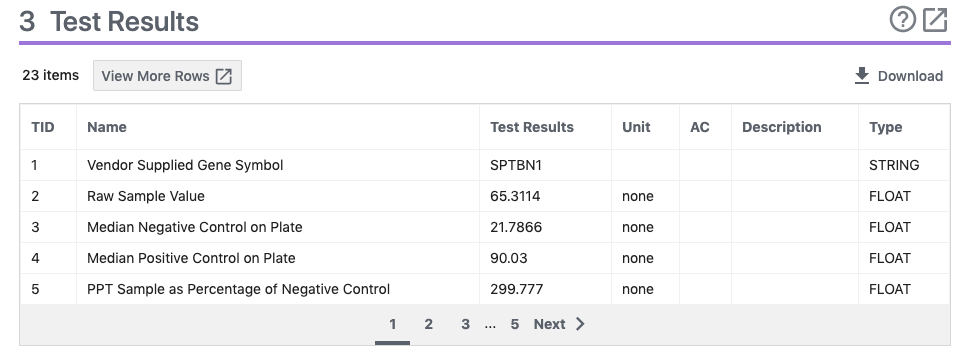

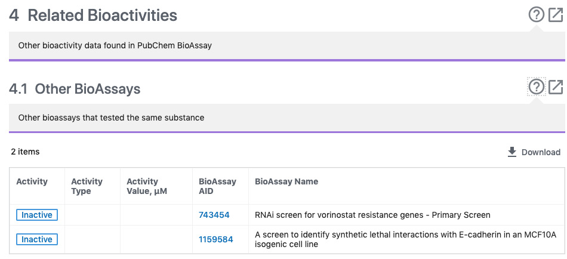

1.  Data Tableの各列のEntrez GeneIDをクリックすると下図のようなページが表示されます。このページでは、遺伝子に関する各種情報を見ることができます。

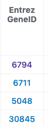

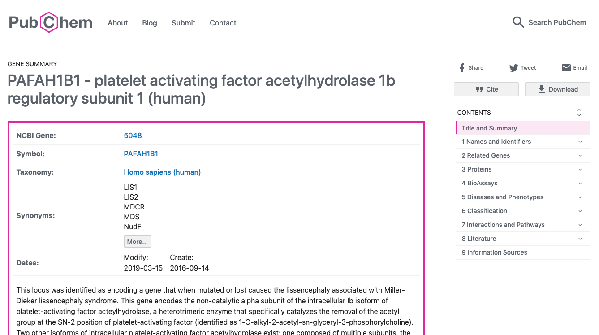

---

### URLへキーワード（遺伝子名、生物種など）を用いた検索

* 以下のようなURLを用いることで、キーワードに該当するエントリーを表示させることもできます。
* [https://pubchem.ncbi.nlm.nih.gov/gene/ACADM/human](https://www.google.com/url?q=https://pubchem.ncbi.nlm.nih.gov/gene/ACADM/human&sa=D&ust=1559232913856000)

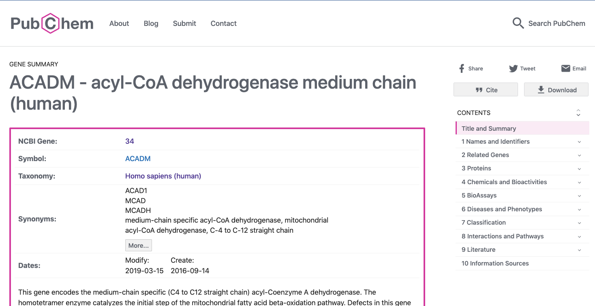

* [https://pubchem.ncbi.nlm.nih.gov/protein/P00533](https://www.google.com/url?q=https://pubchem.ncbi.nlm.nih.gov/protein/P00533&sa=D&ust=1559232913857000)

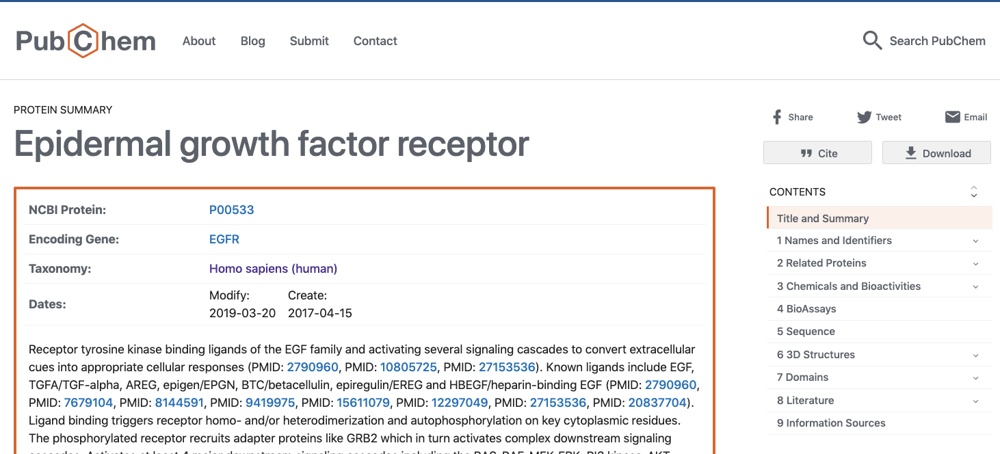

PubChem Classification Browserを使ったデータ取得
----------------------------------------------------------------

1.  下記の検索ボックス下にあるアイコンの右から二番目の"Browse Data"をクリックします。

* または、下記のURLへ移動します。

* [https://pubchem.ncbi.nlm.nih.gov/classification/#hid=1](https://www.google.com/url?q=https://pubchem.ncbi.nlm.nih.gov/classification/%23hid%3D1&sa=D&ust=1559232913858000)

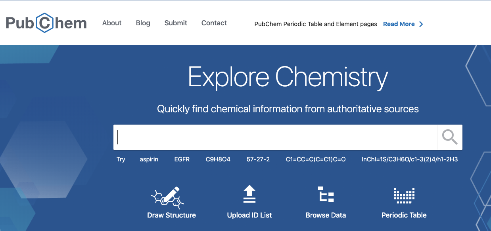

1.  下図のようなClassification Browserが表示されます。

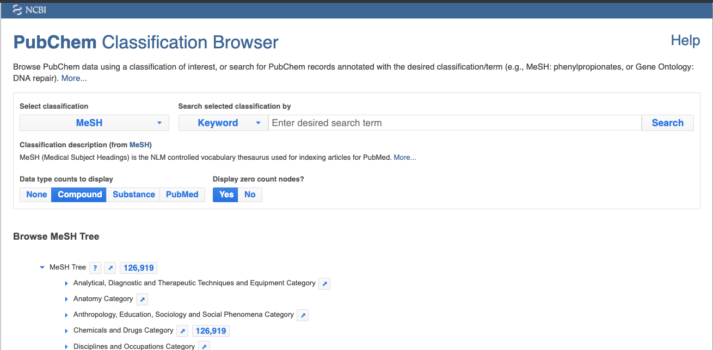

1.  Select classificationで、”ChEMBL”を選択してください。

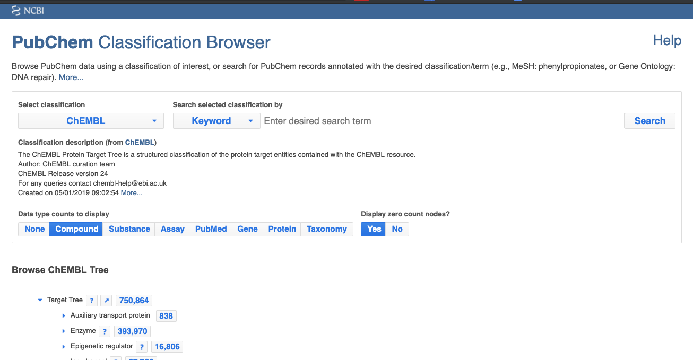

1.  Data type counts to display の下に、None, Compound, Substance, Assay, PubMed, Gene, Protein, Taxonomy が表示されました。

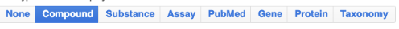

1.  AssayやGeneを選択すると、以下のように項目に含まれる数値が変わります。

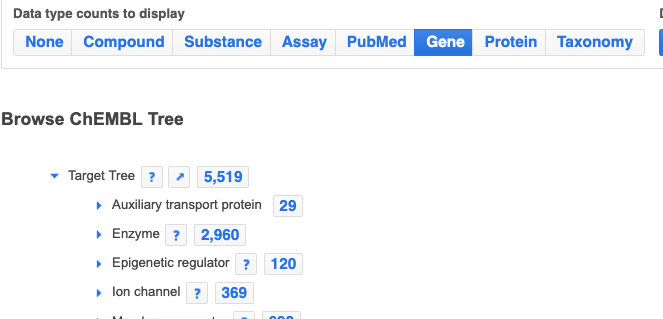

1.  左の青三角をクリックすると下の階層が表示されます。

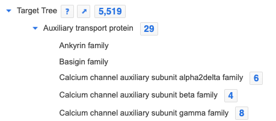

1.  右の青い数字をクリックすると、リストが表示されます。 

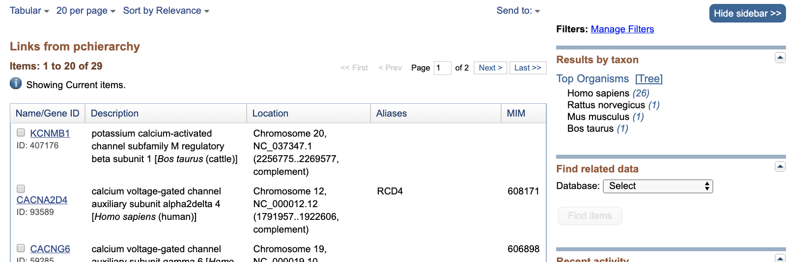

1.  左上のプルダウンで、Format, 表示件数、ソートを変更できます。

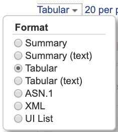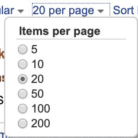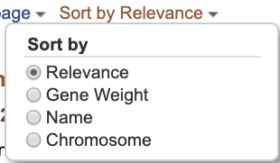

1.  左の Results by taxonから、生物種を選択して絞り込みができます。

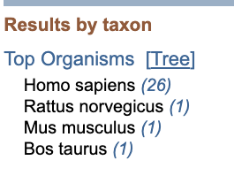

1.  検索（選択）されたリストは右上の”Send to:”のプルダウンから、形式を選択してデータ得ることができます。

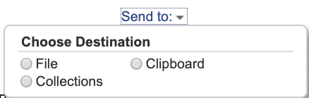

---

---

5. ChEMBL
==================================

ChEMBLの説明
----------------------------------

* ChEMBLとは

* ChEMBLはEBIのChEMBLチームにより維持管理されている化合物の活性などを収録したデータベース

* 以下のリンクも参考になります。

* [https://github.com/Mishima-syk/py4chemoinformatics/blob/master/ch04_database.asciidoc](https://www.google.com/url?q=https://github.com/Mishima-syk/py4chemoinformatics/blob/master/ch04_database.asciidoc&sa=D&ust=1559232913862000)

* ChEMBL Interface Questions

* [https://chembl.gitbook.io/chembl-interface-documentation/frequently-asked-questions/chembl-interface-questions#can-i-edit-the-query-being-used](https://www.google.com/url?q=https://chembl.gitbook.io/chembl-interface-documentation/frequently-asked-questions/chembl-interface-questions%23can-i-edit-the-query-being-used&sa=D&ust=1559232913863000)

* chembl-interface-documentation

* [https://chembl.gitbook.io/chembl-interface-documentation/](https://www.google.com/url?q=https://chembl.gitbook.io/chembl-interface-documentation/&sa=D&ust=1559232913864000)

---

### ウェブブラウザを利用して

1.  #### ChEMBLのサイト（[https://www.ebi.ac.uk/chembl/](https://www.google.com/url?q=https://www.ebi.ac.uk/chembl/&sa=D&ust=1559232913864000)）を開く

* または、Googleなどの検索エンジンで”ChEMBL”と検索し、下記のリンクをクリック

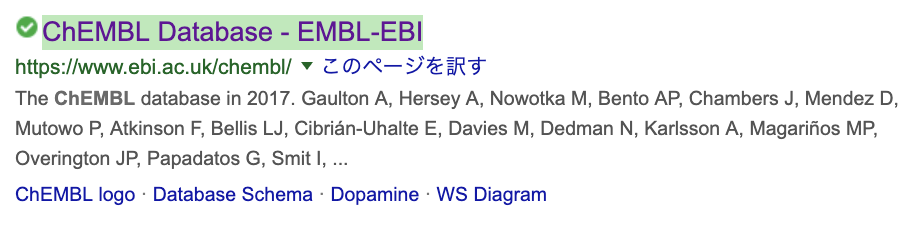

---

1.  #### 概要

##### 含まれるデータの俯瞰

* 左図の"<”, ">"をクリックすると、表示される項目が以下のようにかわります。

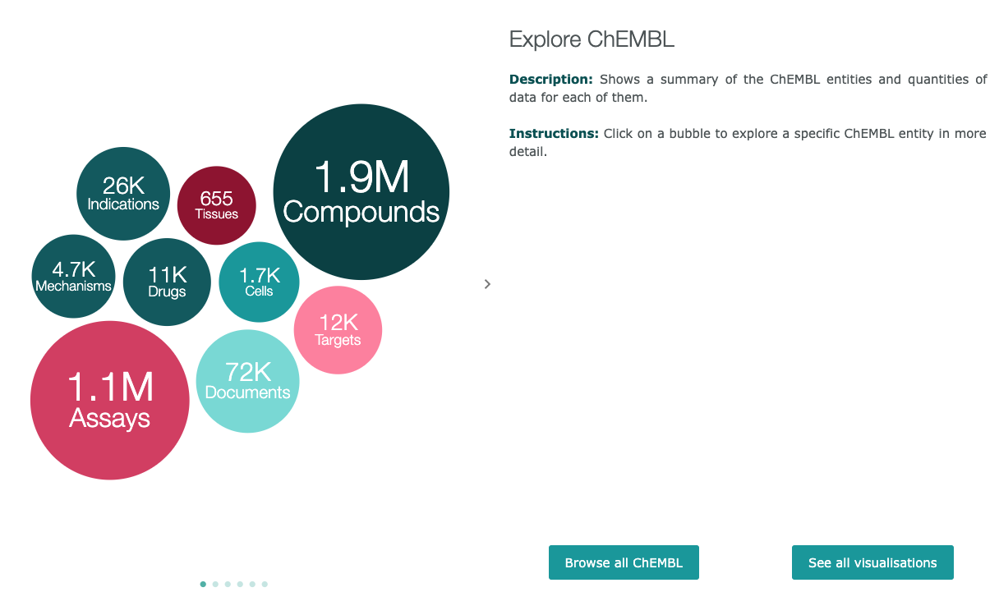

---

##### 階層

* 表示された項目をクリックすることで下の階層を見ることができます。

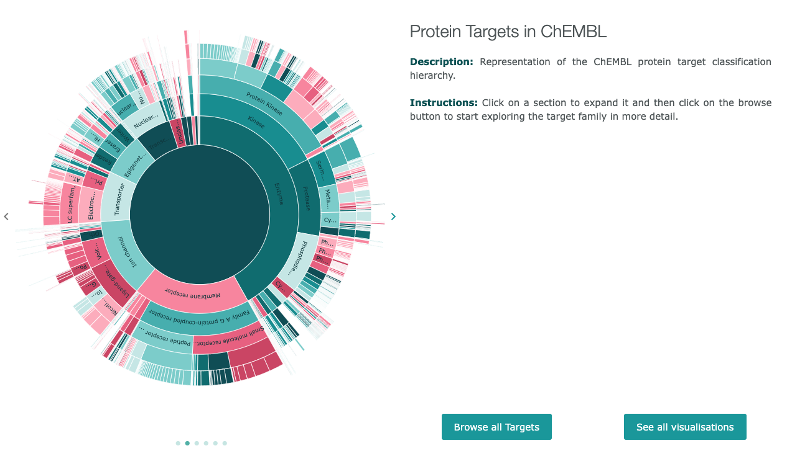

* "Enzyme"をクリックすると下図（中央）のように下の階層を見ることができます。
* さらに"Kinase"をクリックすると下図（右）のように下の階層を見ることができます。

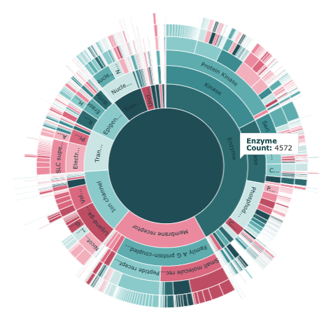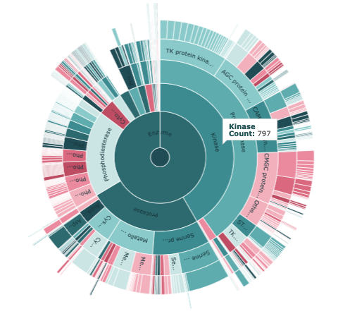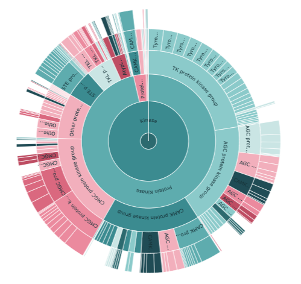

---

##### 年代毎の分子の種類の分布

* マウスオーバーするとデータが表示されます。

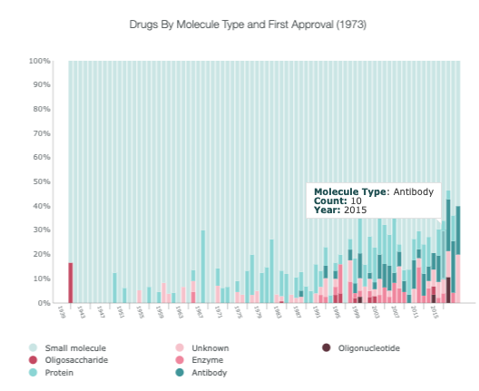

---

##### Taxonomyによる分類

* クリックして中を見ていくことができます。

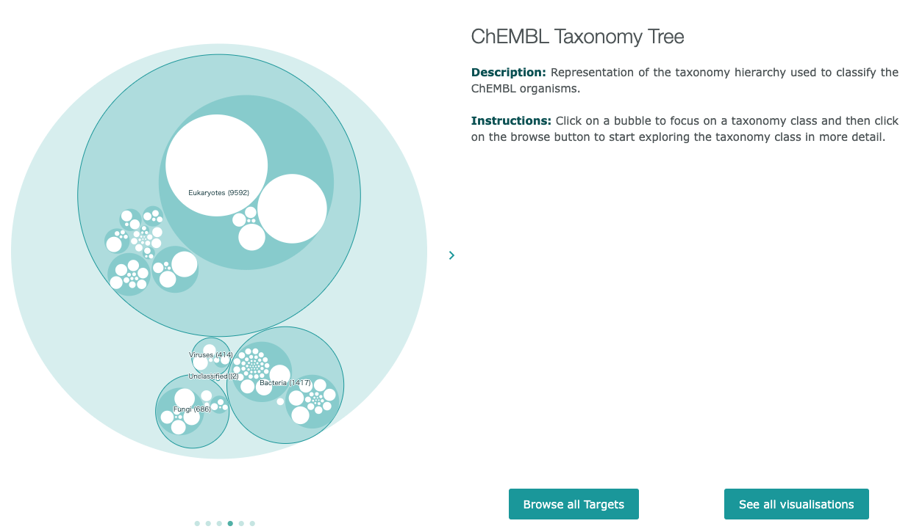

---

##### 開発フェーズとUSAN登録

* マウスオーバーして、クリックするとその情報が表示されます。


---

##### 病気のフェーズ


* 色のついたところをクリックすると下図のような関連する化合物リストが表示されます。


---

##### 化合物


* Compoundsをクリックすると下図のような化合物リストが表示されます。


---

#### 機能の説明

##### 表示切り替え

* 左上のTable, Card, Graph, Heatmapをクリックすると表示を切り替えることができます。


##### 絞り込み

* Filterから絞りたい項目をクリックして選択すると、データを絞り込むことができます。


* で、フィルターをクリアすることができます。

##### データダウンロード

* 右上のアイコンからダウンロートする形式を選んで選択したデータをダウンロードすることができます。


---

#### アッセイ

* 上図の"Assays"をクリックすると、下図のようなアッセイリストが表示されます。


* 左にある”Filters”で、各種条件でフィルターすることができます。


* リストにある”ChEMBL ID”のリンクをクリックすると下図のような”Assay Report Card”が表示されます。

* Assay Report Cardには、Basic Information, Curation Summary, Activity Charts, Compound Summaryが含まれています。


* Bioactivityでクリックすると、活性情報のリストが表示されます。


---

#### targets

* "Targets"をクリックすると、下図のようなリストが表示されます。


Organism: Homo Sapiens, Protein Classification L2: Kinase

* 左にあるFiltersを用いて、絞り込むことができます。


* リストの"ChEMBL ID"をクリックすると、下図のような”Target Report Card”が表示されます。

* ”Target Report Card”には、以下に示すような様々な情報が含まれています。


---

### キーワード検索

#### 化合物・医薬品

レキサルティ

[https://www.kegg.jp/medicus-bin/japic_med?japic_code=00067274](https://www.google.com/url?q=https://www.kegg.jp/medicus-bin/japic_med?japic_code%3D00067274&sa=D&ust=1559232913877000)

“Brexpiprazole”を検索してみましょう

* トップページ右上の入力欄にキーワードを入力します。今回は”Brexpiprazole”


* キーワードを入力すると関連情報が表示されます。ここでは、  


からCompoundsに含まれているデータであることがわかります。

右下に表示されるをクリックすると分子の詳細ページが表示されます。

[https://www.ebi.ac.uk/chembl/compound_report_card/CHEMBL2105760/](https://www.google.com/url?q=https://www.ebi.ac.uk/chembl/compound_report_card/CHEMBL2105760/&sa=D&ust=1559232913879000)


#### 遺伝子名

* MAPK6遺伝子

ヒトでマイトジェン活性化プロテインキナーゼ6をコードするMAPK6遺伝子


からTargetsに含まれていることがわかります。

右下に表示されるをクリックすると[詳細ページ](https://www.google.com/url?q=https://www.ebi.ac.uk/chembl/target_report_card/CHEMBL5121/&sa=D&ust=1559232913882000)へ移動します。


* ここで、マウスカーソルをKdにのせて、クリックすると詳細データが表示されます。


* 各プロットにマウスカーソルをのせると、プロットの情報が表示されます。

BEI / Binding Efficiency Index / 結合効率指数

SEI / Surface-binding Efficiency Index / 表面結合効率指数


---

付録：ドキュメント作成手順
===========================================================

1.  Google Documentで内容作成
2.  Google Documentの”ファイル”→”形式を指定してダウンロード”で、”ウェブページ(html)”を選択する。
3.  ダウンロードしたzipファイルを解凍する。
4.  HTML - Markdown 変換

1.  [https://pronama.jp/md/](https://www.google.com/url?q=https://pronama.jp/md/&sa=D&ust=1559232913886000)

1.  Githubへhtmlとmdファイル、必要な画像ファイルをアップロード

以上

    

